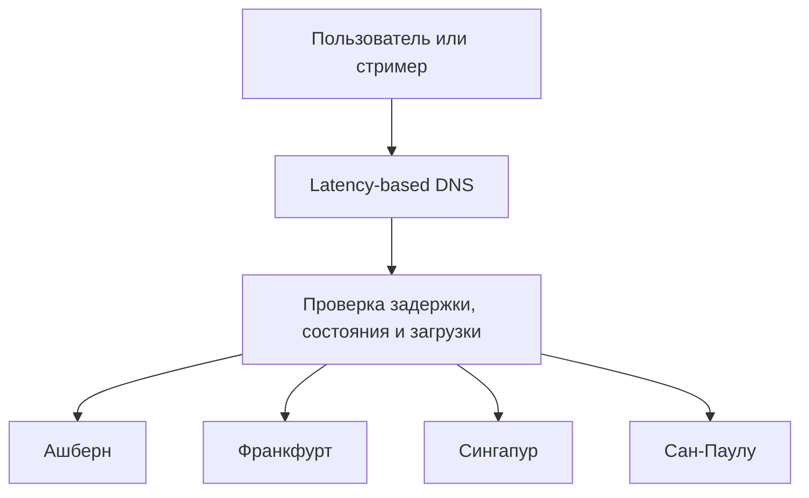
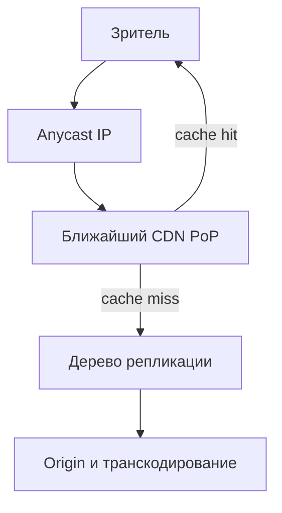

# Расчётно-пояснительная записка для курсовой работы по предмету «Проектирование высоконагруженных систем»

## 1. Тема и целевая аудитория

**Тип сервиса**: платформа интерактивных прямых трансляций (аналог Twitch).

**Основной функционал MVP**:

1. Регистрация и авторизация пользователей;
2. Создание канала и проведение прямой трансляции;
3. Просмотр прямых трансляций с адаптивным качеством видео;
5. Подписка на каналы и получение уведомлений о начале трансляции;
6. Общение в чате трансляции в реальном времени;
7. Просмотр каталога трансляций и поиск каналов;

**Ключевые продуктовые решения**:

1. Публичные трансляции можно смотреть без регистрации;
2. Качество видео автоматически изменяется в зависимости от пропускной способности сети пользователя;
3. Сообщения чата доставляются участникам трансляции в реальном времени;
4. Записи завершённых трансляций хранятся ограниченное время, а созданные пользователями клипы — до их удаления.
5. Просмотр записей завершённых трансляций и создание коротких клипов.

**Ключевые функции, характеризующие сервис**:

1. Проведение и просмотр прямых видеотрансляций;
2. Общение зрителей и автора трансляции в реальном времени;

**Целевая аудитория**: около 105 млн пользователей в месяц и 35 млн пользователей в день по всему миру. По внутренним данным Twitch, сайт посещают в среднем 105 млн пользователей в месяц, около 70% зрителей находятся в возрасте от 18 до 34 лет.[[1]](#source1) По данным Amazon Ads, ежедневно Twitch посещают в среднем 35 млн пользователей со всего мира.[[2]](#source2)

## 2. Расчёт нагрузки

### 2.1. Продуктовые метрики

В расчётах используются опубликованные показатели Twitch: 105 млн MAU, 35 млн DAU, 2,5 млн одновременно активных зрителей, 7 млн стримеров в месяц и 1,3 трлн минут просмотра в год.[[1]](#source1)[[2]](#source2)[[3]](#source3)

Среднее время просмотра на одного дневного пользователя:

```
1,3 трлн / 365 / 35 млн ≈ 102 минуты в сутки
```

| Метрика | На одного DAU в сутки | Всего в сутки | Статус и обоснование |
|---|---:|---:|---|
| Месячная аудитория | — | 105 млн пользователей | Исходная метрика Twitch[[1]](#source1) |
| Дневная аудитория | — | 35 млн пользователей | Исходная метрика Amazon Ads[[2]](#source2) |
| Просмотр прямых трансляций | 102 минуты | 3,56 млрд минут | Расчёт по 1,3 трлн минут в год[[3]](#source3) |
| Открытие страниц | 6,57 | 230 млн | Исходная метрика Twitch; 230 млн / 35 млн DAU[[3]](#source3) |
| Авторизация / обновление сессии | 0,5 | 17,5 млн | Допущение: обновление сессии требуется половине DAU |
| Поиск | 1 | 35 млн | Допущение: один поиск на активного пользователя |
| Отправка сообщения в чат | 3 | 105 млн | Допущение: большинство зрителей только читает чат |
| Подписка / отписка от канала | 0,05 | 1,75 млн | Допущение: одно действие раз в 20 активных дней |
| Просмотр записи трансляции | 0,1 | 3,5 млн | Допущение: 10% DAU смотрят одну запись |
| Просмотр клипа | 0,6 | 21 млн | Допущение: 20% DAU смотрят по три клипа |
| Создание клипа | 0,01 | 350 тыс. | Допущение: 1% DAU создаёт один клип |
| Запуск трансляции | 0,029 | 1 млн | Допущение на основании 7 млн стримеров в месяц[[3]](#source3) |


Число открытий страниц взято из данных Twitch.[[3]](#source3) Остальные действия являются проектными допущениями.

Средний объём данных рассчитан по всей месячной аудитории:

| Тип данных | В среднем на пользователя | Объём | Расчёт |
|---|---:|---:|---|
| Профиль, подписки, чат и метаданные | около 145 записей | менее 0,001 Гбайт | 1 профиль, 50 подписок, 90 сообщений и служебные записи |
| Записи трансляций | 0,067 записи | 0,706 Гбайт | 7 млн записей / 105 млн MAU |
| Клипы | 1,22 клипа | 0,0137 Гбайт | 127,75 млн клипов / 105 млн MAU |
| **Итого** | — | **около 0,72 Гбайт** | Сумма типов данных |

Данные распределены неравномерно: обычный зритель хранит менее 0,1 Мбайт, а на активного стримера приходится около 10,6 Гбайт.

### 2.2. Технические метрики

Для расчётов приняты следующие допущения:

- 1 млн трансляций в сутки со средней длительностью 2,4 часа — около 100 тыс. одновременных трансляций;
- качества 360p, 720p и 1080p имеют битрейты 0,8, 3 и 6 Мбит/с; средний битрейт просмотра — 3,31 Мбит/с;
- полная ABR-лестница занимает 9,8 Мбит/с, или 4,41 Гбайт за час видео;
- записи хранятся 7 суток, сообщения чата — 30 суток, клипы — в среднем 365 суток;
- медиасегмент длится 2 секунды; накладные расходы сети составляют 10%;
- коэффициент пика равен 3 для API и чата и 1,5 для прямого видео.

#### Хранилище

| Тип данных | Количество | Логический объём, Тбайт |
|---|---:|---:|
| Профили, подписки, чат и метаданные | около 9 млрд записей | 1,98 |
| Буфер прямых трансляций за 10 минут | 100 тыс. трансляций | 73,50 |
| Записи трансляций за 7 суток | 7 млн записей | 74 088,00 |
| Клипы | 127,75 млн | 1 437,19 |
| **Итого** | — | **75 600,67 Тбайт (75,6 Пбайт)** |

Объём указан без репликации и резервных копий. Основную часть хранилища занимают записи трансляций.

#### Сетевой трафик

Пропускная способность рассчитывается как произведение количества одновременных потоков на битрейт. Суточный объём: `трафик × 86 400 / 8`.

| Тип трафика | Средний, Гбит/с | Пиковый, Гбит/с | Гбайт/сутки |
|---|---:|---:|---:|
| Раздача прямых трансляций | 9 102,5 | 13 653,8 | 98 307 000 |
| Приём потоков стримеров | 660,0 | 990,0 | 7 128 000 |
| Записи трансляций и клипы | 201,1 | 603,2 | 2 171 400 |
| Чат и HTTP API | 10,0 | 30,0 | 107 866 |
| **Итого** | **9 973,5** | **15 276,9** | **107 714 266 (107,7 Пбайт)** |

Это глобальный трафик сервиса. Основной исходящий поток должен обслуживаться распределённой CDN.

#### RPS

Средний RPS рассчитывается по формуле `количество операций / 86 400`. Для пика используется коэффициент 3, а для прямого видео — 1,5.

| Метод или операция | Операций в сутки | Средний RPS | Пиковый RPS |
|---|---:|---:|---:|
| Получение страницы и метаданных трансляции | 230 млн | 2 662 | 7 986 |
| Авторизация / обновление сессии | 17,5 млн | 203 | 608 |
| Поиск | 35 млн | 405 | 1 215 |
| Подписки, управление трансляцией и создание клипа | 4,1 млн | 47 | 142 |
| Отправка сообщения чата | 105 млн | 1 215 | 3 646 |
| Доставка сообщения чата | 210 млрд | 2,43 млн | 7,29 млн |
| Плейлисты и сегменты прямого видео | 216 млрд | 2,50 млн | 3,75 млн |
| Сегменты записей и клипов | 2,42 млрд | 27 952 | 83 856 |

Для чата принят средний fan-out 2 000 получателей: 105 млн сообщений дают 210 млрд доставок в сутки. Это соответствует опубликованному Twitch порядку нагрузки — сотням миллиардов доставок сообщений в сутки.[[3]](#source3)

Таким образом, HTTP API обрабатывает около 3,3 тыс. RPS в среднем и 10 тыс. RPS в пике. Основная нагрузка приходится на CDN и доставку сообщений чата.

## 3. Глобальная балансировка нагрузки

### 3.1. Функциональное разбиение по доменам

| Домен                     | Назначение                                         | Способ балансировки                                 |
| ------------------------- | -------------------------------------------------- | --------------------------------------------------- |
| `www.twitch-clone.com`    | Веб-интерфейс и статические ресурсы                | CDN и Anycast                                       |
| `api.twitch-clone.com`    | Авторизация, каталог, поиск, подписки и метаданные | Latency-based DNS между дата-центрами               |
| `ingest.twitch-clone.com` | Приём видеопотоков от стримеров                    | GeoDNS и маршрутизация по загрузке origin-кластеров |
| `video.twitch-clone.com`  | HLS-сегменты прямых трансляций, записей и клипов   | CDN и Anycast                                       |
| `chat.twitch-clone.com`   | WebSocket-соединения чата                          | Latency-based DNS с привязкой сессии к региону      |

Разделение доменов позволяет независимо масштабировать API, приём трансляций, раздачу видео и чат.

### 3.2. Размещение дата-центров

Twitch использует почти сто точек присутствия — PoP — и несколько origin-центров, соединённых собственной магистральной сетью.[[4]](#source4) В проектируемой системе принимаются четыре активных региональных дата-центра:

| Регион                          | Расположение        | Доля нагрузки | Обоснование                                                 |
| ------------------------------- | ------------------- | ------------: | ----------------------------------------------------------- |
| Северная Америка                | Ашберн, США         |           35% | Обслуживание пользователей Северной Америки                 |
| Европа, Ближний Восток и Африка | Франкфурт, Германия |           35% | Центральное расположение относительно европейской аудитории |
| Азиатско-Тихоокеанский регион   | Сингапур            |           20% | Обслуживание Южной и Восточной Азии                         |
| Латинская Америка               | Сан-Паулу, Бразилия |           10% | Снижение задержки для пользователей Южной Америки           |

Twitch не публикует точное распределение аудитории по регионам, поэтому доли являются проектным допущением. После запуска сервиса веса должны корректироваться по фактическому трафику.

Все дата-центры работают по схеме active-active. Расположение инфраструктуры ближе к пользователям уменьшает время начала воспроизведения, задержку чата и потери пакетов при передаче потока стримером.

### 3.3. Распределение нагрузки

Региональная нагрузка рассчитывается по формуле:

```text
Региональная нагрузка = глобальная пиковая нагрузка × доля региона
```

Пиковая нагрузка на медиаконтент составляет:

```text
3 750 000 + 83 856 ≈ 3,834 млн RPS
```

где 3,75 млн RPS приходится на прямые трансляции, а 83 856 RPS — на записи и клипы.

| Регион                          | HTTP API, RPS |      CDN, RPS | Доставка чата, событий/с | Входящие трансляции | Трафик, Гбит/с |
| ------------------------------- | ------------: | ------------: | -----------------------: | ------------------: | -------------: |
| Северная Америка                |         3 500 |     1,342 млн |                2,552 млн |              52 500 |        5 346,9 |
| Европа, Ближний Восток и Африка |         3 500 |     1,342 млн |                2,552 млн |              52 500 |        5 346,9 |
| Азиатско-Тихоокеанский регион   |         2 000 |     0,767 млн |                1,458 млн |              30 000 |        3 055,4 |
| Латинская Америка               |         1 000 |     0,383 млн |                0,729 млн |              15 000 |        1 527,7 |
| **Итого**                       |    **10 000** | **3,834 млн** |             **7,29 млн** |         **150 000** |   **15 276,9** |

Видеотрафик из таблицы обслуживается преимущественно CDN PoP соответствующего региона, а не напрямую сетевыми интерфейсами origin-центра.

### 3.4. DNS-балансировка

Для `api`, `chat` и `ingest` применяется latency-based DNS с проверками доступности.[[5]](#source5) DNS-сервер возвращает адрес ближайшего работоспособного регионального балансировщика. Дополнительно учитываются текущая загрузка региона и доступная пропускная способность.



Для DNS-записей принимается TTL 60 секунд. Это позволяет достаточно быстро переключать новые подключения при отказе региона, не создавая чрезмерную нагрузку на DNS.

DNS-переключение действует только на новые соединения. Уже установленные RTMP- и WebSocket-соединения при отказе должны переподключиться к следующему доступному региону.

### 3.5. Anycast-балансировка

Для доменов `www` и `video` используется Anycast: один IP-адрес анонсируется через BGP из нескольких CDN PoP, после чего сеть направляет запрос в ближайшую доступную точку.[[6]](#source6)



Anycast применяется для независимых HTTP-запросов плейлистов, сегментов и статических файлов. Для RTMP-трансляций и WebSocket-чата Anycast не используется, поскольку изменение маршрута может разорвать долгоживущее соединение.

### 3.6. Регулирование трафика между дата-центрами

Для управления глобальным трафиком используются следующие механизмы:

1. Глобальный контроллер собирает данные о доступности, задержке, загрузке процессоров транскодирования и пропускной способности каждого региона.
2. GeoDNS изменяет веса регионов и перестаёт направлять новые подключения в перегруженный или недоступный дата-центр.
3. При подключении стримера маршрутизатор выбирает не только ближайший, но и достаточно свободный origin-центр. После начала трансляция закрепляется за выбранным origin.
4. Видеосегменты передаются от origin по внутренней магистральной сети к региональным CDN PoP и кешируются там.
5. Для каждого канала выбирается основной регион чата. Сообщения упорядочиваются в нём, после чего передаются региональным узлам рассылки.
6. При отказе CDN PoP его BGP-маршрут отзывается, и Anycast направляет новые запросы в другую точку присутствия.
7. При перегрузке трафик перенаправляется в следующий ближайший регион. Дополнительно может ограничиваться необязательный API-трафик и снижаться качество видео средствами ABR.

Такая схема позволяет локализовать основную нагрузку внутри региона, одновременно сохраняя возможность перенаправления пользователей при перегрузке или отказе дата-центра.


## Список источников

1. <a id="source1"></a>[Twitch Ads — Reach the Twitch audience](https://twitchadvertising.tv/)
2. <a id="source2"></a>[Amazon Ads — Curious about Twitch ads? Here’s everything you need to know](https://advertising.amazon.com/library/guides/twitch-ads)
3. <a id="source3"></a>[Twitch — Twitch State of Engineering 2023](https://blog.twitch.tv/en/2023/09/28/twitch-state-of-engineering-2023/)
